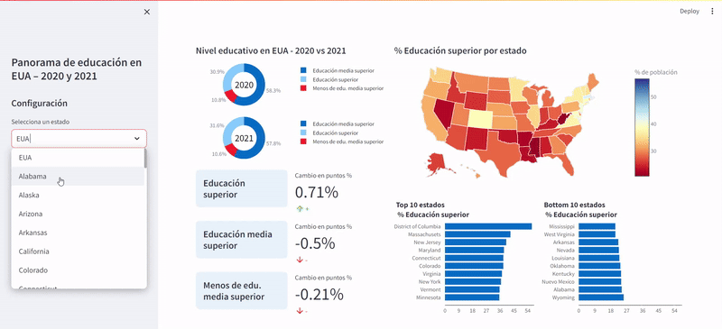
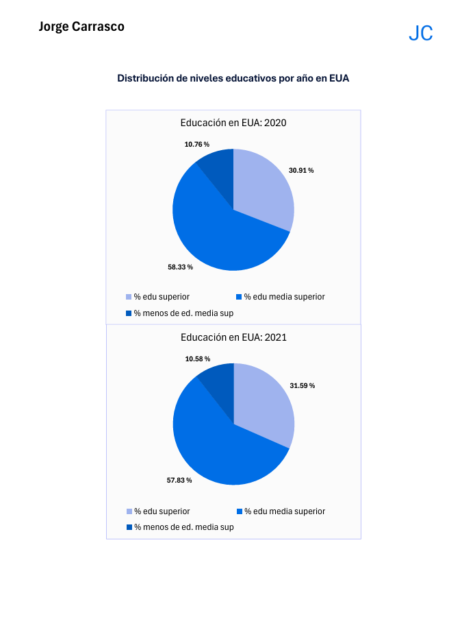
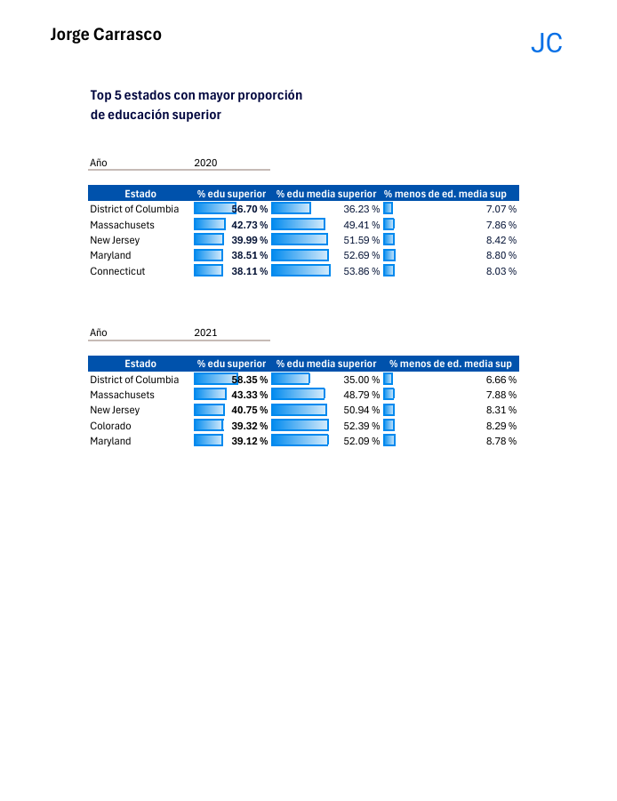
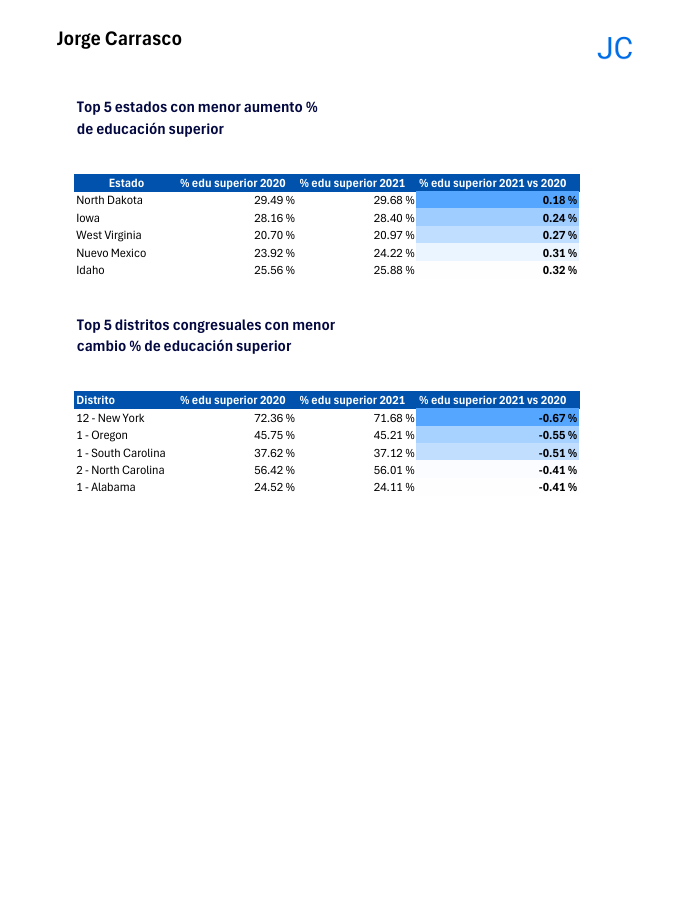

# Educacion-EUA-2020vs2021

Dashboard interactivo acerca del panorama de educación en EUA para los años 2020 y 2021. Desarrollado con python, pandas y streamlit.

**Tabla de contenidos**

1. [Descripción de los datos](#descripción-de-los-datos)

2. [Preguntas que se quieren responder](#preguntas-que-se-quieren-responder)

3. [Propuesta de solución](#propuesta-de-solución)

4. [Revisión y limpieza de datos](#revisión-y-limpieza-de-datos)

5. [Transformación de datos](#transformación-de-datos)

6. [Respuesta a preguntas planteadas](#respuesta-a-preguntas-planteadas)
    - [Reportes en Excel](#reportes-en-excel)
    - [Dashboard en python con streamlit](#dashboard-en-python-con-streamlit)

7. [Origen de los datos](#origen-de-los-datos)

## Descripción de los datos

Información sobre la población estimada de personas pertenecientes a varios grupos de edad que tienen niveles de educación específicos. Información acumulada a un nivel de los distritos congresuales de EUA para años determinados.

### El conjunto de datos

Esta tabla / csv contiene información con las siguientes columnas / características / *features*:

- Año
- Distrito congresual *(Congressional district)*
- Individuos con Licenciatura *(Bachelor's degree)* o un grado mayor
- Individuos con Certificado de preparatoria *(highschool diploma)* o algún grado
- Individuos con educación menor a tener Certificado de preparatoria

Donde cada fila representa la partición de la población en cada Distrito congresual *(Congressional district)* por nivel de educación, por año (2020 y 2021). El nivel educativo se refiere al equivalente de **educación superior**, **educación media superior** y **menos de educación media superior** en México.

## Preguntas que se quieren responder

1. ¿Cuál es la **distribución** de la educación en el **país**? *(2020 y 2021)*

2. ¿Cuál es el **top 5** con la **mayor proporción** de individuos con **educación superior**? *(2020 y 2021, distritos congresuales y estados)*

3. ¿Cuál es el **bottom 5** con la **menor proporción** de individuos con **educación superior**? *(2020 y 2021, distritos congresuales y estados)*

4. ¿Cuál es el **top 5** con la **mayor proporción** de individuos con **menos de educación media superior**? *(2020 y 2021, distritos congresuales y estados)*

5. ¿Cuál es el **bottom 5** con la **menor proporción** de individuos con **menos de educación media superior**? *(2020 y 2021, distritos congresuales y estados)*

6. ¿Cuáles son las regiones con un **mayor aumento porcentual** en educación superior de 2020 a 2021? *(distritos congresuales y estados)*

7. ¿Cuáles son las regiones con un **menor aumento porcentual** en educación superior de 2020 a 2021? *(distritos congresuales y estados)*

## Propuesta de solución

### Reportes puntuales en Excel

Reportes estáticos en Excel que muestren gráficos y tablas comparativas que respondan las preguntas planteadas por estado, distrito congresual y año.

|     |     |     |
| --- | --- | --- |
|  |  |  |

### Dashboard interactivo en python con streamlit

Dashboard interactivo que aborde las preguntas planteadas referentes a los estados por año y que muestre información complementaria de las proporciones por niveles educativos.

## Revisión y limpieza de datos

Se hizo la siguiente revisión de calidad de los datos como se muestra en el notebook [Educacion.ipynb](<Revision de datos/Educacion.ipynb>):

- Datos faltantes
- Duplicados y valores únicos en Año y Distrito congresual
- Rangos de valores numéricos

En Excel se hizo el mismo procedimiento utilizando **Power Query**, como se puede ver en este [libro de Excel](<Reportes Excel/Educacion.xlsx>).

## Transformación de datos

Se hizo la siguiente transformación de datos como se muestra en el notebook [Educacion.ipynb](<Revision de datos/Educacion.ipynb>):
- Mapear códigos de estado a nombre de estado (**AK** -> **Alaska**)
- Agregar datos de educación por estado
- Crear columnas con proporciones (%) por nivel educativo por estado por año
- Calcular diferencia de en puntos porcentuales de 2020 a 2021 por nivel educativo por estado.

En Excel se hizo el mismo procedimiento utilizando **Power Query**, como se puede ver en este [libro de Excel](<Reportes Excel/Educacion.xlsx>).

## Respuesta a preguntas planteadas

### Reportes en Excel

Las respuestas a todas las preguntas planteadas son responddas por los reportes generados en Excel contenidos en el archivo PDF: [Educacion.pdf](<Reportes Excel/Educacion.pdf>). Estos reportes tienen un formato similar a los siguientes:

|     |     |     |
| --- | --- | --- |
|  |  |  |

Estos reportes cuentan con un formato condicional que facilita la lectura de la información y la comparación entre los distintos estados y distritos congresuales a los que se hace referencia.

### Dashboard en python con streamlit

El dashboard desarrollado en python con streamlit responde todas las preguntas planteadas referentes a los estados y muestra información complementaria como:

- **Top 10** en vez de **Top 5** estados para niveles educativos por año seleccionado
- **Aumento / Cambio %** de 2020 a 2021 para los **tres niveles educativos**
- Gráfica de pastel para la **distribución del nivel educativo** para EUA y **todos los estados**
- **Mapa interactivo** que representa los porcentajes del nivel educativo seleccionado por estado, por año seleccionado

## Origen de los datos

*Origen de los datos: https://www.kaggle.com/datasets/mittvin/u-s-census-dataset-education-finance-industry/data*

*Licencia original de los datos: [CC0: Public Domain](https://creativecommons.org/publicdomain/zero/1.0/)*